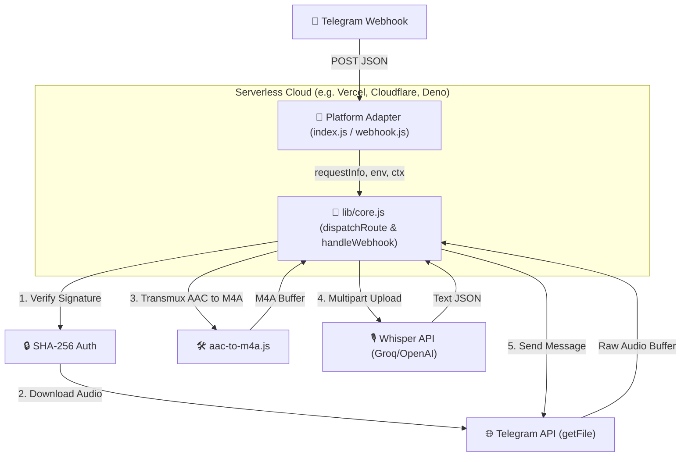

# DEVNOTES: AAC Processing and Core Solutions 🎵⚙️

In Telegram, voice messages and audio files might be delivered as raw ADTS-AAC streams, even if their file paths end with `.m4a`.

The Whisper API (particularly Groq's instance) **rejects** raw AAC files. To resolve this, our bot automatically detects raw ADTS-AAC streams and wraps them in a standard fragmented-MP4 (M4A) container.

---

## 1. Detecting ADTS-AAC Format

A raw AAC stream with ADTS (Audio Data Transport Stream) framing always begins with a 12-bit sync-word set to `1111 1111 1111` (`0xFFF`).

We inspect the first two bytes of the audio buffer:
* The first byte must be exactly `0xFF` (`11111111`).
* The upper 4 bits of the second byte must be `0xF` (`1111xxxx`), meaning `(buffer[1] & 0xF0) === 0xF0`.

```javascript
function isAdtsAac(buffer) {
  if (!buffer || buffer.length < 2) return false;
  return buffer[0] === 0xFF && (buffer[1] & 0xF0) === 0xF0;
}
```

* Standard M4A/MP4 containers start with an `ftyp` box (for example, `00 00 00 18 66 74 79 70 69 73 6f 6d` for `ftypisom`), making this signature check highly reliable.

---

## 2. Transmuxing using `mux.js`

To repackage the stream without re-encoding the audio (transmuxing), we use the lightweight library `mux.js`. This allows the conversion to happen almost instantaneously and avoids spawning resource-heavy binary tools like FFmpeg.

### Critical Bugs in `mux.js` (issue #436) & Patches
Official versions of `mux.js` (`6.x`) generate invalid metadata when wrapping standalone AAC streams. When sending such files to FFmpeg or Groq Whisper API, they reject the file with the error: `Invalid data found when processing input`.

To solve this, we have implemented a patcher script [scripts/postinstall.js](file:///D:/Dev/val-town/transcribot/scripts/postinstall.js) that runs automatically after every `npm install`.

The patch makes three key replacements:
1. **Reset Movie Header Duration (`mvhd`):**
   * *Before:* `mvhd(0xffffffff)` (representing indefinite/infinite duration).
   * *After:* `mvhd(0)` (delegates duration handling to the track level).
2. **Fix Track Header Duration (`tkhd`):**
   * *Before:* `track.duration || 0xffffffff`
   * *After:* `track.duration` (preserves the actual track duration).
3. **Assign Valid Audio Track ID:**
   * *Before:* `audioTrack = audioTrack || {`
   * *After:* `audioTrack = audioTrack || { id: 1,` (without this, the generated track ID is `0`, which is invalid in standard MP4 formats).

---

## 3. Webhook Integration Flow (`webhook.js`)

When a file is received:
1. Download the audio file into a memory buffer.
2. Check the signature using `isAdtsAac(buffer)`.
3. If it is AAC:
   * Instantiate a transmuxer: `transmuxer = new muxjs.mp4.Transmuxer({})`.
   * Collect the generated chunks: `initSegment` (container metadata) and `data` blocks (raw frames).
   * Concatenate them into a single `Uint8Array`.
   * Rewrite the file extension to `.m4a` and set the MIME type to `audio/mp4`.
4. Send the buffer to Groq Whisper API.

> [!NOTE]
> If transmuxing fails (e.g., due to file corruption), the logic gracefully falls back and attempts to send the original buffer to Whisper API to prevent the webhook from crashing.

---

## 4. File Size Limits

To prevent payload errors and stay within API constraints, the bot performs file size validation before starting the download or calling APIs.

### Size Limitations & Constraints:
1. **Telegram Bot API (`getFile`):** The standard cloud Bot API enforces a **20 MB** download limit per file. This is the primary bottleneck for standard bot setups.
2. **Vercel/Netlify Payload Limits:** Note that while serverless hosts like Vercel (4.5 MB) and Netlify (6 MB) enforce payload limits on incoming webhook requests and outgoing responses, these **do not** restrict outgoing HTTP `fetch` requests (such as downloading from Telegram or uploading to Groq). Therefore, the bot can support the full 20 MB Telegram limit.
3. **Groq Whisper API:** Uploaded files via `multipart/form-data` are capped at **25 MB**.
4. **Bypassing the 20 MB Limit**: To process files larger than 20 MB (up to 2 GB), you must run a Local Bot API Server or use the Telegram Client API (MTProto).

### Implementation:
We declare constants `MAX_MB = 20` and `MAX_FILE_SIZE = MAX_MB * 1024 * 1024` in `lib/core.js`.
* Before downloading the file, the bot checks the `file_size` parameter in the Telegram message update.
* If the file size exceeds `MAX_FILE_SIZE`, the bot halts execution and notifies the user with a localized warning referencing the Telegram Bot API limit.

---

## 5. API Error Formatting

For easier debugging, API errors (such as non-OK status codes from Groq or Telegram) are returned to the user inside a Markdown code-block rather than a spoiler:
```html
<pre><code class="language-json">Error details...</code></pre>
```
This preserves technical layout, prevents accidental hiding under spoiler overlays, and allows easy copy-pasting for logs.

---

## 6. Localization Strategy

The bot supports localized runtime responses for Telegram users (`en`, `ru`, `de`, `ukr`) based on their Telegram interface language. This dictionary resides inside [lib/localize.js](file:///D:/Dev/val-town/transcribot/lib/localize.js). Do not hardcode localized user-facing strings elsewhere; retrieve them via the `getTranslation(langCode, key)` helper instead.

---

## 7. Background Execution & `ctx.waitUntil`

In a synchronous webhook flow, the bot must keep the HTTP connection with Telegram open until the Whisper API finishes transcription. 
If the transcription takes longer than the serverless platform's execution timeout (e.g., 10 seconds on some free tiers), the function gets killed, and Telegram does not receive a `200 OK`. Telegram will then retry sending the same message, causing the bot to transcribe it multiple times (duplicate processing).

To mitigate this, future architectural improvements could implement background execution:
- By adopting `ctx.waitUntil(promise)` (which is natively supported by Cloudflare Workers), the bot can immediately return `200 OK` to Telegram and process the audio download and transcription entirely in the background.
- This prevents Telegram from retrying, saves Whisper API limits, and makes the bot virtually immune to long-audio timeouts.

---

## 8. Unified Core Architecture Diagram

The bot uses a "Unified Core Engine" architecture. Platform-specific adapters parse HTTP requests into a standardized `requestInfo` object and delegate all business logic to `lib/core.js`. This prevents routing duplication and ensures the bot works identically across all supported clouds.


